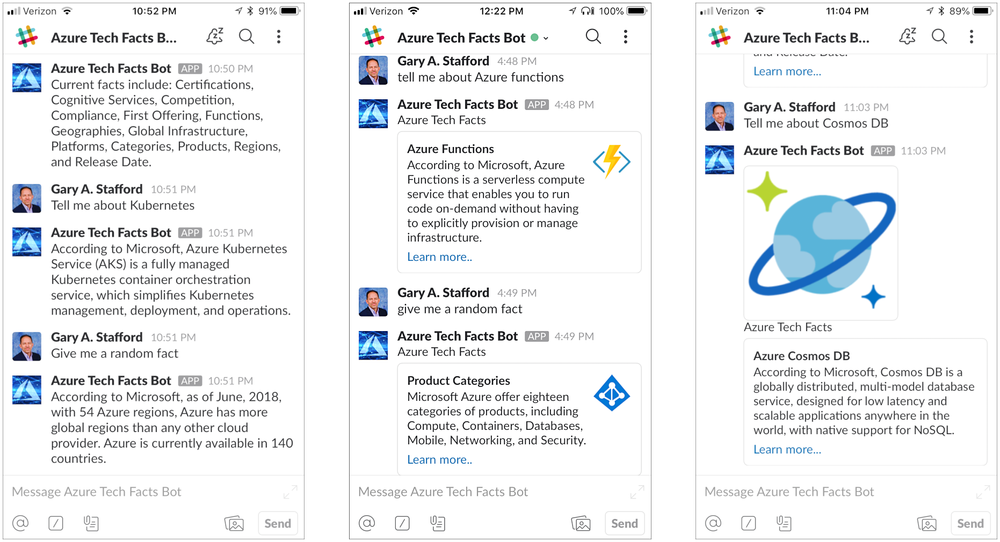
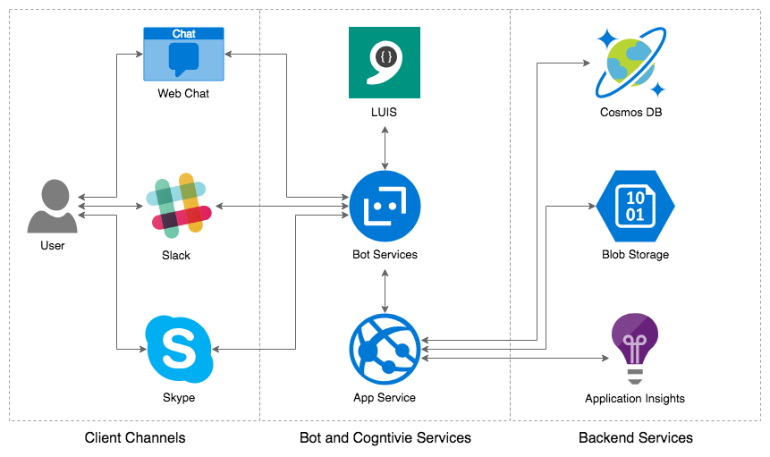

# LUIS-enabled Chatbot

Project for the accompanying post, [Building and Integrating LUIS-enabled Chatbots with Slack, using Azure Bot Service, Bot Builder SDK, and Cosmos DB](https://programmaticponderings.com/).

The post, publised 8/27/2018, explores the development of a machine learning-based LUIS-enabled chatbot using the Azure Bot Service and the BotBuilder SDK. The chatbot’s functionality is enhanced with Azure’s Cloud services, including Cosmos DB and Blob Storage. Once built the chatbot is integrated across multiple channels, including Web Chat and Slack.

## Architecture

A chatbot user interacts with the chatbot through a number of available channels, such as the Web, Slack, and Skype. The channels communicate with the Web App Bot, part of Azure Bot Service, and running on Azure’s App Service, the fully-managed platform for cloud apps. LUIS integration allows the chatbot to learn and understand the user’s intent based on the bot’s own domain-specific natural language model.

Through Azure’s App Service platform, our chatbot is able to retrieve data from Cosmos DB and images from Blob Storage. The chatbot’s telemetry is available through Azure’s Application Insights.

